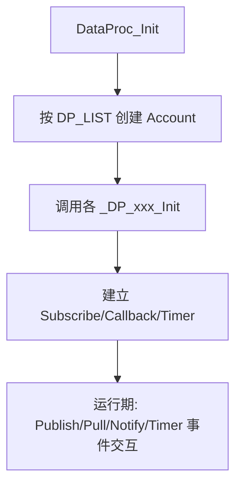

# X-TRACK DataProc 节点逐个说明表

> 说明范围：`Software/X-Track/USER/App/Common/DataProc` 中的数据处理节点，以及 `StatusBar` 节点（实现位于页面目录）。

---

## 1) 节点总表（按 DP_LIST）

| 节点 | 缓冲区 | 主要职责 | 主要输入（Subscribe/Pull） | 主要输出（Publish/Notify） | 触发方式 |
|---|---:|---|---|---|---|
| Storage | 0 | 存储装载/保存、SD信息查询、地图目录配置 | SysConfig、SD事件、Storage命令 | Storage基础信息、MapConv配置 | Notify / Pull |
| Clock | 0 | 系统时钟获取、首次GPS校时 | TzConv、GPS | Clock_Info（Pull返回） | Publish / Pull |
| GPS | `sizeof(GPS_Info_t)` | GPS状态汇聚与有效定位发布 | HAL::GPS_GetInfo | GPS发布、连接提示音通知MusicPlayer | Timer / Pull |
| Power | 0 | 电池状态获取与充电状态提示音 | HAL::Power_GetInfo | Power_Info（Pull返回）、MusicPlayer通知 | Timer / Pull |
| SportStatus | `sizeof(SportStatus_Info_t)` | 运动统计（速度/里程/时长/卡路里） | GPS、Storage | SportStatus发布 | Timer / Pull |
| Recorder | 0 | GPX轨迹录制控制与写盘 | GPS、Clock、TrackFilter、Recorder命令 | TrackFilter命令联动 | Publish / Notify / Pull |
| IMU | `sizeof(IMU_Info_t)` | IMU数据提交 | HAL::IMU回调 | 提交IMU缓存 | HAL回调 |
| MAG | `sizeof(MAG_Info_t)` | 磁力计数据提交 | HAL::MAG回调 | 提交MAG缓存 | HAL回调 |
| StatusBar | 0 | 状态栏外观与录制标记控制 | GPS、Power、Clock、Storage、StatusBar命令 | 状态栏UI更新 | Notify |
| MusicPlayer | 0 | 音频播放代理 | MusicPlayer命令 | 调用HAL::Audio_PlayMusic | Notify |
| TzConv | 0 | GPS时间+时区转换 | GPS、SysConfig | 转换后Clock_Info（Pull返回） | Pull |
| SysConfig | 0 | 系统配置装载/保存/提供 | Storage、GPS、SysConfig命令 | SysConfig（Pull返回） | Notify / Pull |
| TrackFilter | 0 | 轨迹点坐标转换与抽稀 | GPS、TrackFilter命令 | 轨迹容器状态（Pull返回） | Publish / Notify / Pull |

---

## 2) 节点逐个说明（简表）

### 2.1 Storage
- 关键代码：`DP_Storage.cpp`
- 设计要点：
  - `STORAGE_CMD_LOAD/SAVE/ADD/REMOVE` 命令式接口；
  - Load 后拉取 `SysConfig` 配置 `MapConv`；
  - SD插入事件回调时触发自动LOAD。

### 2.2 Clock
- 关键代码：`DP_Clock.cpp`
- 设计要点：
  - 订阅 GPS 与 TzConv；
  - GPS首次有效后校时并取消对 GPS 订阅，减少后续干扰；
  - 主要通过 Pull 返回 `Clock_Info_t`。

### 2.3 GPS
- 关键代码：`DP_GPS.cpp`
- 设计要点：
  - Timer 里读取 HAL GPS 快照；
  - 以卫星数做状态机（断开/不稳/连接）并通知 MusicPlayer；
  - 卫星数>=3才 Commit+Publish。

### 2.4 Power
- 关键代码：`DP_Power.cpp`
- 设计要点：
  - Pull 时读取 HAL 电池信息；
  - 对电量做滞回+中值滤波，降低显示抖动；
  - 充电状态变化触发提示音。

### 2.5 SportStatus
- 关键代码：`DP_SportStatus.cpp`
- 设计要点：
  - Timer 每500ms拉取 GPS；
  - 累积里程、总时长、均速、最高速度、卡路里；
  - 关键字段通过 `STORAGE_VALUE_REG` 接入持久化。

### 2.6 Recorder
- 关键代码：`DP_Recorder.cpp`
- 设计要点：
  - `START/PAUSE/CONTINUE/STOP` 状态切换；
  - Start 写 GPX 头，Publish GPS 时写 `trkpt`，Stop 写尾并关文件；
  - 命令同步通知 TrackFilter 保持一致状态。

### 2.7 IMU / MAG
- 关键代码：`DP_IMU.cpp` / `DP_MAG.cpp`
- 设计要点：
  - 通过 HAL 回调直接 Commit 到各自账户缓存；
  - 轻量桥接型节点，保持传感器数据接入统一总线。

### 2.8 StatusBar
- 关键代码：`Pages/StatusBar/StatusBar.cpp`（节点定义在页面目录）
- 设计要点：
  - 接收 `STATUS_BAR_CMD_APPEAR/SET_STYLE/SET_LABEL_REC` 通知；
  - 订阅 GPS/Power/Clock/Storage，用于顶部状态信息展示。

### 2.9 MusicPlayer
- 关键代码：`DP_MusicPlayer.cpp`
- 设计要点：
  - 只处理 Notify 命令；
  - 把音乐名转发给 `HAL::Audio_PlayMusic`。

### 2.10 TzConv
- 关键代码：`DP_TzConv.cpp`
- 设计要点：
  - Pull GPS 与 SysConfig，执行时区转换；
  - 供 Clock 节点校时路径调用。

### 2.11 SysConfig
- 关键代码：`DP_SysConfig.cpp`
- 设计要点：
  - 管理系统配置项（语言、地图目录、时区、音效等）；
  - 支持 `SYSCONFIG_CMD_LOAD/SAVE`；
  - 与 Storage、GPS 协同做开机恢复和关机落盘。

### 2.12 TrackFilter
- 关键代码：`DP_TrackFilter.cpp`
- 设计要点：
  - 订阅 GPS 发布，转换地图坐标并做关键点抽稀；
  - `START/PAUSE/CONTINUE/STOP` 管理轨迹容器生命周期；
  - Pull 可返回轨迹容器和活动状态给地图页。

---

## 3) DataProc 初始化与调用关系（速览）

一句话总结：DataProc 把“硬件输入”转成“业务节点输出”，通过统一的 Account 事件模型完成跨模块协作。
