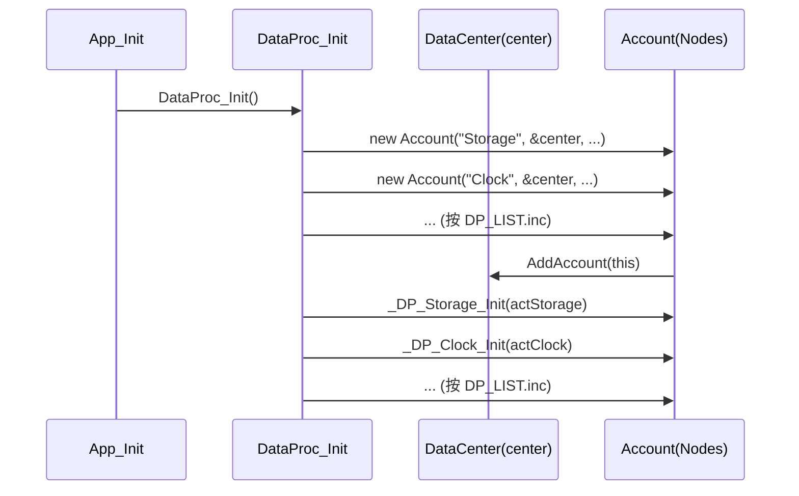
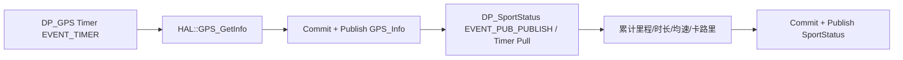
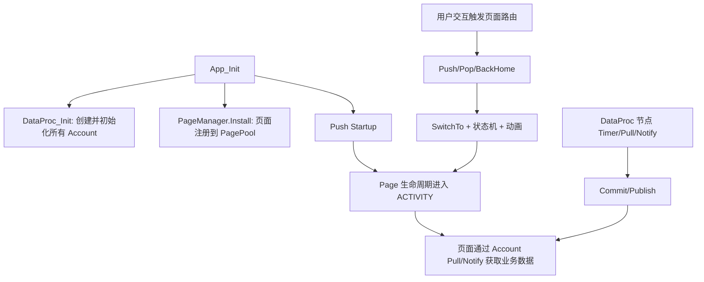

# X-TRACK 中间数据层（DataProc）与页面管理（PageManager）详解

> 目标：围绕你关心的四件事做源码级展开：
> 1) 详细初始化过程；2) 数据管理机制；3) 页面管理机制；4) 调用与注册的完整流程。

---

## 1. 总体关系：App_Init 如何把“数据层 + 页面层”接起来

`App_Init()` 是中间数据层和页面层的汇合点，关键顺序是：

1. 创建 `AppFactory` 与 `PageManager`（静态对象）；
2. 执行 `DataProc_Init()`，注册所有数据节点；
3. 向 `Storage` 与 `SysConfig` 发送 LOAD 命令；
4. 初始化资源与状态栏；
5. 安装页面并 Push 首屏。

```mermaid
flowchart TD
    A[App_Init] --> B[DataProc_Init]
    B --> C[AccountMain.Notify(Storage LOAD)]
    C --> D[AccountMain.Notify(SysConfig LOAD)]
    D --> E[ResourcePool::Init + StatusBar_Create]
    E --> F[PageManager.Install(...)]
    F --> G[PageManager.Push(Pages/Startup)]
```

这意味着系统不是“先页面、后数据”，而是先把数据面搭起来，再推进页面生命周期。

---

## 2. DataProc 初始化过程（节点创建 + 节点初始化）

## 2.1 双阶段初始化

`DataProc_Init()` 通过 `DP_LIST.inc` 进行了两遍展开：

- **第一遍**：`new Account(...)`，把所有节点对象注册到同一个 `DataCenter`；
- **第二遍**：调用各节点 `_DP_xxx_Init(account)` 完成订阅关系、回调函数、定时器周期等配置。



## 2.2 节点列表与缓存策略

`DP_LIST.inc` 给出了所有节点及缓存大小（`BUFFER_SIZE`）：

- 有缓存：如 `GPS(sizeof(HAL::GPS_Info_t))`、`SportStatus(sizeof(HAL::SportStatus_Info_t))`；
- 无缓存：如 `Storage/Clock/Power/Recorder/...` 为 0。

含义：

- 有缓存节点可 `Commit + Publish` 推送稳定数据快照；
- 无缓存节点更适合命令通知、即时 Pull、状态协调。

---

## 3. DataCenter / Account 数据管理机制

## 3.1 数据中心（DataCenter）

`DataCenter` 的核心职责：

- 保存账户池（`AccountPool`）；
- 提供按 ID 查找（`SearchAccount` / `Find`）；
- 统一管理主账户 `AccountMain`。

关键点：`AddAccount()` 时，`AccountMain` 会自动 `Subscribe(account->ID)`，因此主账户可以直接对任意节点 `Notify()`（这就是 `ACCOUNT_SEND_CMD` 宏可工作的原因）。

## 3.2 Account 的四类事件语义

Account 通过统一事件模型通信：

- `EVENT_PUB_PUBLISH`：发布者向所有订阅者广播缓存数据；
- `EVENT_SUB_PULL`：订阅者主动向发布者拉取；
- `EVENT_NOTIFY`：订阅者向发布者发送命令/通知；
- `EVENT_TIMER`：节点自定时器触发。

## 3.3 缓存与发布（Commit / Publish）

- `Commit(data, size)`：写入 ping-pong buffer；
- `Publish()`：取读缓冲，遍历订阅者并调用其 event callback。

这个设计保证“写入与读取”解耦，降低读写冲突。

## 3.4 主动拉取与命令下发（Pull / Notify）

- `Pull(pubID, ...)`：由订阅者触发，发布者在 `EVENT_SUB_PULL` 分支返回数据；
- `Notify(pubID, ...)`：由订阅者下发命令，发布者在 `EVENT_NOTIFY` 分支处理。

> 在 App 层，`AccountMain.Notify("Storage", &info, sizeof(info))` 就是典型命令下发。

## 3.5 节点定时器（SetTimerPeriod）

`Account::SetTimerPeriod(period)` 基于 `lv_timer_create` 创建节点定时器，回调统一进入 `EVENT_TIMER`，再由节点回调函数处理。

这使 DataProc 节点既能事件驱动，也能按固定周期自更新。

---

## 4. DataProc 的“注册后如何跑起来”：完整调用流程

以下以“启动加载配置 + GPS 到运动统计”为例。

## 4.1 启动加载（Storage/SysConfig）

```mermaid
flowchart LR
    A[App_Init] --> B[AccountMain.Notify(Storage LOAD)]
    B --> C[DP_Storage onEvent(EVENT_NOTIFY)]
    C --> D[storageService.LoadFile]
    D --> E[Pull SysConfig]
    E --> F[MapConv 参数设置]

    A --> G[AccountMain.Notify(SysConfig LOAD)]
    G --> H[DP_SysConfig onEvent(EVENT_NOTIFY)]
```

## 4.2 GPS -> SportStatus



这里会同时服务 UI 与存储：

- UI 页面 Pull 或订阅运动数据刷新控件；
- Storage 节点通过注册键值持久化核心统计字段。

---

## 5. PageManager 初始化与注册机制

## 5.1 Install -> Register

`manager.Install(className, appName)` 过程：

1. 通过 `Factory->CreatePage(className)` 创建页面对象；
2. 重置基础字段（`root/ID/Manager/UserData/priv`）；
3. 调用 `onCustomAttrConfig()` 同步页面自定义属性；
4. `Register(base, appName)` 加入 `PagePool`。

`Register` 会做重名检查，随后写入：

- `base->Manager = this`
- `base->Name = name`
- `PagePool.push_back(base)`

## 5.2 App 中的页面注册

在 `App_Init()` 中被安装的页面有：

- `Pages/_Template`
- `Pages/LiveMap`
- `Pages/Dialplate`
- `Pages/SystemInfos`
- `Pages/Startup`

随后调用 `manager.Push("Pages/Startup")` 进入首屏。

---

## 6. 页面管理流程：Push / Pop / BackHome / 状态机

## 6.1 Push 详细流程

`Push(name, stash)` 的关键步骤：

1. `SwitchAnimStateCheck()`：若动画忙则拒绝；
2. 防止重复入栈：`FindPageInStack(name)`；
3. 从 `PagePool` 找页面实例；
4. 同步自动缓存策略；
5. `PageStack.push(base)`；
6. `SwitchTo(base, true, stash)` 进入切换。

## 6.2 Pop 详细流程

1. 先检查动画忙状态；
2. 取栈顶页面；
3. 若启用自动缓存，则弹栈时关闭缓存标记（确保可卸载）；
4. 弹栈后取新栈顶，`SwitchTo(next, false, nullptr)`。

## 6.3 BackHome 详细流程

`BackHome()` 会：

- `SetStackClear(true)`：清理到仅保留栈底 Home 页面；
- `PagePrev = nullptr`；
- `SwitchTo(home, false)`。

## 6.4 SwitchTo 的核心动作

`SwitchTo` 是路由核心：

- 置位 `AnimState.IsSwitchReq`；
- 如有 `stash` 则分配/复用内存并拷贝；
- 设置 `PageCurrent` 与初始状态（缓存页直接 `WILL_APPEAR`，否则 `LOAD`）；
- 设置进出场标记 `Anim.IsEnter`；
- Push 场景更新动画类型；
- 执行 `StateUpdate(PagePrev)` 与 `StateUpdate(PageCurrent)`；
- 调整图层前后顺序。

## 6.5 页面状态机（StateUpdate）

状态推进顺序：

`LOAD -> WILL_APPEAR -> DID_APPEAR -> ACTIVITY -> WILL_DISAPPEAR -> DID_DISAPPEAR -> (WILL_APPEAR 或 UNLOAD) -> IDLE`

关键执行点：

- `StateLoadExecute`：创建 root、`onViewLoad/onViewDidLoad`、缓存策略判定；
- `StateWillAppearExecute`：`onViewWillAppear` + 开启动画；
- `StateDidAppearExecute`：`onViewDidAppear`；
- `StateWillDisappearExecute`：`onViewWillDisappear` + 开启动画；
- `StateDidDisappearExecute`：`onViewDidDisappear`，按是否缓存决定回到 `WILL_APPEAR` 还是 `UNLOAD`；
- `StateUnloadExecute`：释放 stash、异步删 root、`onViewDidUnload`。

---

## 7. “中间层 + 页面层”联动：注册与调用的完整闭环



一句话概括：

- **DataProc** 负责“业务状态生产与命令处理”；
- **PageManager** 负责“页面实例管理与生命周期调度”；
- 两者通过 `Account` 事件模型形成“数据驱动页面、页面反向发命令”的双向闭环。

---

## 8. 实际维护建议（针对本仓库）

1. **新增业务能力优先新增 DP 节点**，再让页面订阅/拉取，避免页面直接耦合 HAL；
2. **页面参数传递统一使用 stash**，并确保大小一致，避免复用错误；
3. **缓存策略按页面特性显式配置**（高频切换页可缓存，重资源页考虑及时卸载）；
4. **Notify 命令结构体务必 `DATA_PROC_INIT_STRUCT` 清零后再填写**，减少脏数据风险；
5. **Push/Pop 前避免重入请求**，如果存在连击交互，应在业务层做节流。

