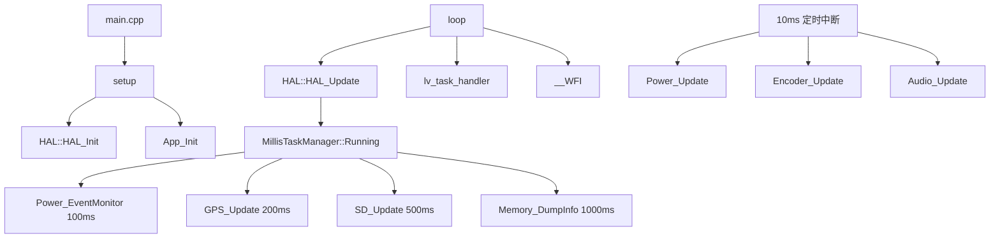
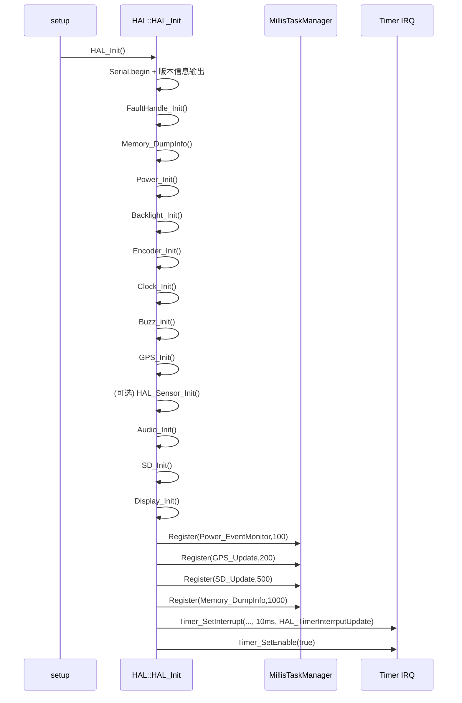
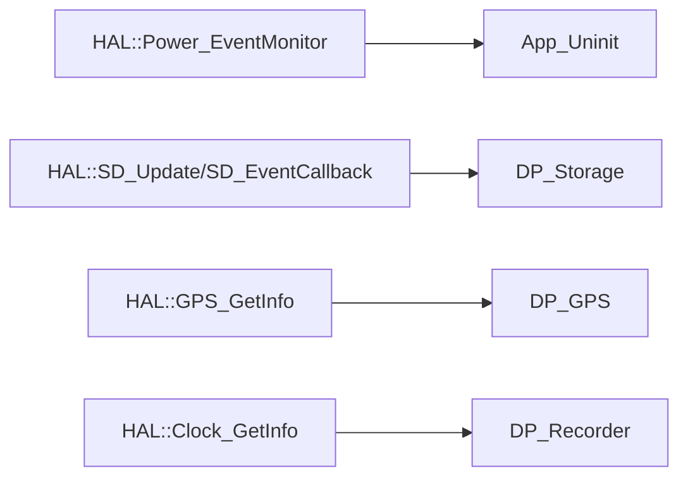
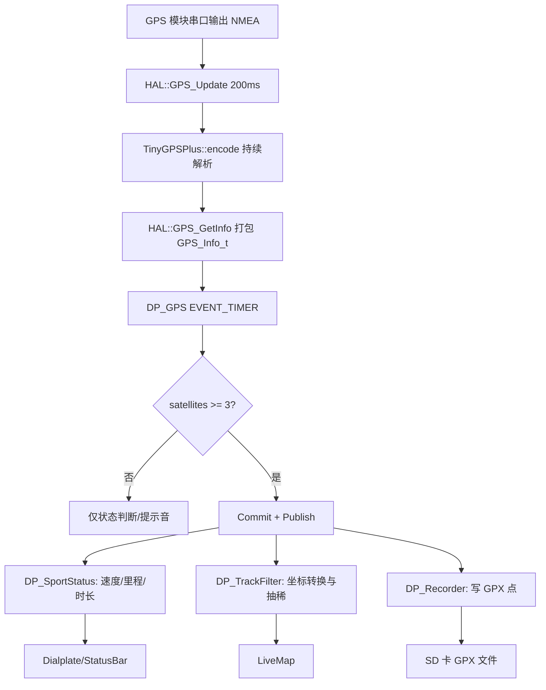

# X-TRACK HAL 层任务与主流程详解（基于源码）

> 本文聚焦 `Software/X-Track/USER/HAL` 的实现细节，重点说明：
> 1) HAL 层的任务如何被调度；2) 主流程如何从 `main` 进入并运行；3) 关键函数之间如何调用与回调。

---

## 1. HAL 层在系统中的定位

HAL 在本项目中的角色是“**硬件能力统一出口 + 时基调度入口**”：

- 上接 `main.cpp` 和 `App`；
- 下接 GPS/SD/电源/旋钮/蜂鸣器/显示等具体驱动；
- 通过 `HAL_Init()` 完成初始化，通过 `HAL_Update()` 驱动周期任务。



---

## 2. 启动主流程（main -> HAL_Init -> App）

`main.cpp` 的启动路径非常清晰：

1. 芯片底层初始化：`NVIC_PriorityGroupConfig`、`GPIO_JTAG_Disable`、`Delay_Init`；
2. 调用 `setup()`：
   - `HAL::HAL_Init()`
   - `lv_init()` 与 `lv_port_init()`
   - `App_Init()`
   - `HAL::Power_SetEventCallback(App_Uninit)`（注册关机前应用清理回调）
3. 进入死循环 `loop()`：
   - `HAL::HAL_Update()`
   - `lv_task_handler()`
   - `__WFI()`

这代表系统运行模型是：**前台单循环 + 后台定时任务 + 中断补充**。

---

## 3. HAL_Init 的初始化序列（函数调用顺序）

`HAL::HAL_Init()` 采用“先基础、后外设、再调度”的顺序：



### 3.1 传感器条件初始化

`HAL_Sensor_Init()` 先调用 `I2C_Scan()`：

- 若总线上无设备：输出 `I2C: disable sensors` 并退出；
- 若检测到设备：按编译开关分别调用 `IMU_Init()` / `MAG_Init()`，初始化成功后把 `IMU_Update()` / `MAG_Update()` 以 `1000ms` 周期注册到任务管理器。

这种策略可避免“传感器缺失导致系统启动失败”。

---

## 4. 两套时基：任务调度与中断回调

HAL 实际上有两套并行时基。

## 4.1 任务调度器（ms 级）

由 `HAL_Update()` 调用 `taskManager.Running(millis())` 驱动，主要跑“业务级轮询任务”：

| 任务函数 | 周期 | 用途 |
|---|---:|---|
| `Power_EventMonitor` | 100ms | 监测关机请求并执行关机流程 |
| `GPS_Update` | 200ms | 读取串口 NMEA 字符流并喂给 TinyGPS++ |
| `SD_Update` | 500ms | 监测 SD 插拔并触发回调/提示音 |
| `Memory_DumpInfo` | 1000ms | 输出内存/栈等调试信息 |
| `IMU_Update`/`MAG_Update` | 1000ms（条件启用） | 传感器采样更新 |

## 4.2 定时中断（10ms）

`Timer_SetInterrupt(..., 10 * 1000, HAL_TimerInterrputUpdate)` 触发的中断回调固定执行：

- `Power_Update()`：电池 ADC 轮询 + 自动低功耗计时；
- `Encoder_Update()`：按键状态机监测（含长按关机）；
- `Audio_Update()`：TonePlayer 播放推进。

设计意图是把“交互实时性更敏感”的模块放入更稳定节拍。

---

## 5. 关键模块调用链详解

## 5.1 电源模块（Power）

### 入口与状态

- `Power_Init()`：
  - 初始化供电控制脚；
  - 初始化电池 ADC；
  - 设置自动低功耗参数；
- `Power_Shutdown()`：只设置 `ShutdownReq=true`（一次性）；
- `Power_SetEventCallback(cb)`：注册关机前回调（在 `setup()` 中指向 `App_Uninit`）。

### 周期与执行链

```mermaid
flowchart TD
    IRQ[10ms IRQ] --> PU[Power_Update]
    PU --> ADC[每1000ms更新一次 ADC]
    PU --> LP[检查自动低功耗超时]
    LP -->|超时| SR[Power_Shutdown: 置位 ShutdownReq]

    TM[taskManager 100ms] --> PM[Power_EventMonitor]
    PM -->|ShutdownReq=true| CB[调用 EventCallback(App_Uninit)]
    CB --> BL[Backlight_SetGradual(0)]
    BL --> OFF[digitalWrite POWER_EN LOW]
```

这条链路清楚地分离了“**请求关机**”与“**执行关机**”：

- 请求可能来自长按、超时、业务逻辑；
- 真正下电由 `Power_EventMonitor()` 在任务上下文中完成，避免在中断/异步处做重操作。

## 5.2 旋钮与按键（Encoder）

- `Encoder_Init()`：
  - A/B 相引脚与按键引脚初始化；
  - `attachInterrupt(CONFIG_ENCODER_A_PIN, Encoder_EventHandler, FALLING)`；
  - 绑定 `ButtonEvent` 回调。
- A 相中断触发 `Encoder_EventHandler()`：读取 B 相判断方向，累计 `EncoderDiff`，并调用 `Buzz_Handler()` 提供转动声反馈；
- `Encoder_Update()` 在 10ms 节拍中调用 `EncoderPush.EventMonitor(...)`，驱动按键事件机：
  - `EVENT_PRESSED/RELEASED`：切换旋转增量是否禁用；
  - `EVENT_LONG_PRESSED`：调用 `Power_Shutdown()` + `Audio_PlayMusic("Shutdown")`。

## 5.3 音频模块（Audio + Buzz）

- `Audio_Init()` 给 `TonePlayer` 设置回调：`(freq, volume) -> HAL::Buzz_Tone(freq)`；
- `Audio_PlayMusic(name)` 在音乐表中查找并触发 `player.Play`；
- `Audio_Update()` 在 10ms 节拍推进播放器状态；
- 最终硬件输出由 `Buzz_Tone` 执行。

调用链可概括为：

`业务事件 -> Audio_PlayMusic -> TonePlayer -> Audio_Update -> Buzz_Tone -> GPIO/PWM 发声`

## 5.4 GPS 模块

- `GPS_Init()`：打开串口并输出库版本；
- `GPS_Update()`（200ms）：
  - 读取串口缓存；
  - 字节流喂给 `gps.encode(c)`；
  - 透明转发模式下允许调试串口透传；
- `GPS_GetInfo()`：将 TinyGPS++ 状态打包到 `GPS_Info_t`（经纬度、速度、时间、卫星数等）。

注意：`GPS_Update` 负责“喂数据”，`GPS_GetInfo` 负责“取解析结果”，是典型生产者-消费者分离。

## 5.5 SD 卡模块

- `SD_Init()`：
  - 检测插卡脚；
  - 初始化 SdFat；
  - 设置 FAT 时间回调（时间来源 `Clock_GetInfo`）；
  - 检查/创建轨迹目录；
- `SD_Update()`（500ms）通过 `CM_VALUE_MONITOR` 监测插拔状态变化并进入 `SD_Check`：
  - 插入：重新初始化 SD，成功后触发 `SD_EventCallback(true)` 并播报插入音；
  - 拔出：标记不可用，触发 `SD_EventCallback(false)` 并播报拔出音。

这条链路让上层 DataProc 可通过回调及时重载/卸载存储逻辑。

---

## 6. HAL 与 App/DataProc 的关键接口关系

HAL 不直接管理业务，但通过回调与数据接口支撑上层：

1. **关机协作**：
   - `setup()` 调用 `HAL::Power_SetEventCallback(App_Uninit)`；
   - HAL 触发关机事件时先执行 `App_Uninit`，实现配置与记录保存。
2. **存储协作**：
   - `HAL::SD_SetEventCallback` 供 DataProc::Storage 注册；
   - SD 插入后可触发上层 `LOAD` 行为。
3. **数据协作**：
   - DataProc 节点通过 `HAL::GPS_GetInfo/Clock_GetInfo/Power_GetInfo/...` 拉取硬件状态。



---

## 7. 调用方式总结：谁调用谁

可用一句话概括：

- **主循环调用 HAL**：`loop -> HAL_Update`；
- **HAL 调任务函数**：`HAL_Update -> taskManager.Running -> 各周期任务`；
- **中断调用 HAL 子更新函数**：`TIM IRQ -> HAL_TimerInterrputUpdate -> Power/Encoder/Audio`；
- **HAL 再回调上层**：`Power_EventCallback(App_Uninit)`、`SD_EventCallback(...)`；
- **上层按需 Pull HAL 数据**：DataProc 在事件中调用 `HAL::*_GetInfo()`。

这就是本项目函数间调用的核心闭环：

`main/loop -> HAL 调度 -> 设备更新 -> 回调/数据接口 -> App/DataProc 消费`。

---

## 8. 维护建议（面向后续开发）

1. **新增外设任务优先挂载到 taskManager**，并明确周期（避免塞入中断回调导致抖动）；
2. **中断回调仅放短逻辑**，重操作交给轮询任务或上层消息处理；
3. **涉及关机路径的模块必须可重入/幂等**，确保 `App_Uninit` 被调用时不会阻塞关机；
4. **所有 `*_GetInfo` 输出结构体保持零初始化与字段完整性**，降低上层 size/字段误用风险。

---

## 9. GPS 全流程（从获取数据到更新数据）

本节按“硬件输入 -> HAL 解析 -> DataProc 发布 -> 业务/页面消费”给出完整路径。

### 9.1 HAL 侧：采集与解析

1. `HAL::GPS_Init()` 打开 GPS 串口（9600）并输出库版本；
2. `HAL::GPS_Update()`（在任务调度中每 200ms 调用）循环读取 `GPS_SERIAL` 字节流；
3. 每个字节喂入 `TinyGPSPlus::encode(c)`，库内部持续更新定位、速度、时间、卫星数；
4. 上层调用 `HAL::GPS_GetInfo()` 时，将 TinyGPS++ 当前状态打包为 `GPS_Info_t`。

这一步的核心是“**持续喂流 + 按需取快照**”。

### 9.2 DataProc 侧：节点定时发布

1. `DP_GPS` 在 `EVENT_TIMER` 中调用 `HAL::GPS_GetInfo(&gpsInfo)`；
2. 根据卫星数判断连接状态并在状态变化时 `Notify("MusicPlayer")` 播放提示音；
3. 当卫星数 `>=3` 时：
   - `account->Commit(&gpsInfo, sizeof(gpsInfo))`
   - `account->Publish()`

因此，GPS 从“原始串口流”变为“可订阅的业务消息”。

### 9.3 消费侧：统计、轨迹、页面

- `DP_SportStatus` 周期 Pull/消费 GPS，计算速度、里程、时长、卡路里；
- `DP_TrackFilter` 订阅 GPS 发布，做坐标转换与抽稀；
- `DP_Recorder` 在录制激活时消费 GPS + Clock，写入 GPX 轨迹点；
- 页面（如 Dialplate/LiveMap）通过 DataProc 拉取或订阅结果刷新显示。



### 9.4 时序特征与注意点

- GPS 喂流是 200ms 周期任务，不是中断路径；
- `GPS_GetInfo()` 读取的是“当前解析快照”，不是阻塞式等待定位；
- 卫星阈值（如 3、5、7）用于控制发布与提示音状态机；
- 轨迹记录链路依赖 SD 可用与 Recorder 激活状态。

