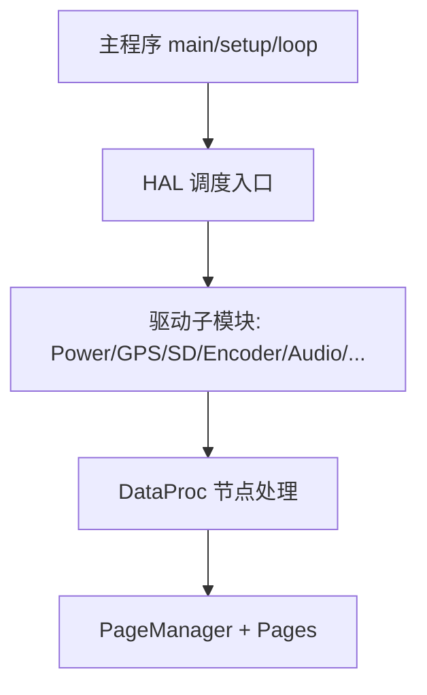
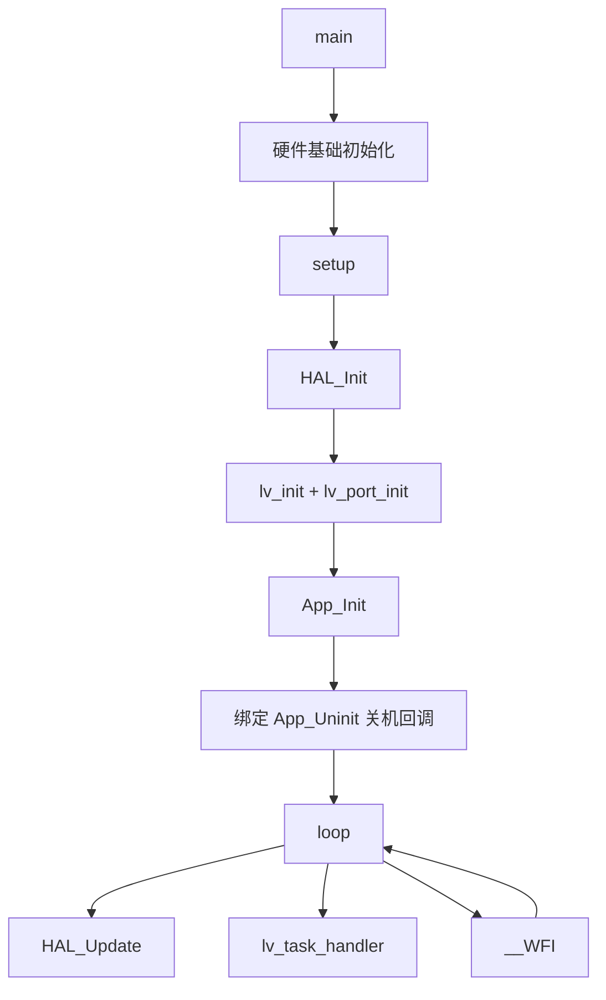
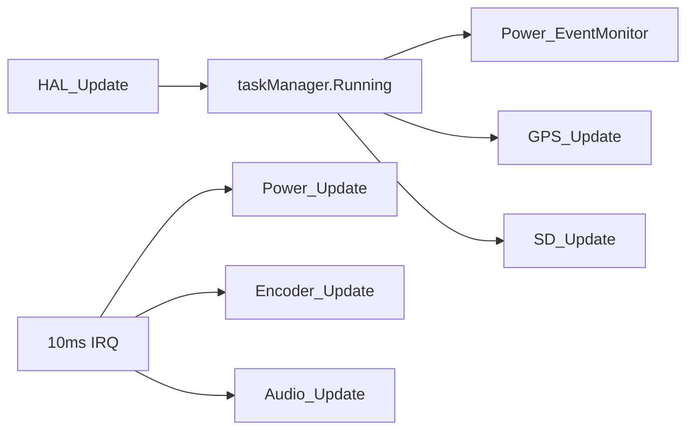
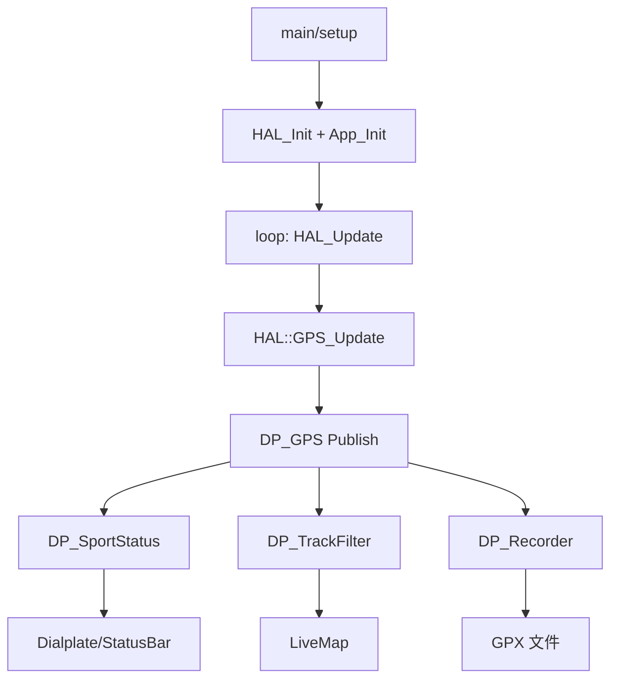

# X-TRACK Software 主程序流程与子模块驱动划分详解

> 目标：回答“主程序流程如何划分、子模块驱动流程如何划分、设计思路与实现代码如何组织”。

---

## 1. 总体划分思路：主流程 vs 子模块驱动

这个项目采用“**主循环极简 + 子模块分层驱动**”思路：

- **主程序流程（Main Flow）**：负责系统启动、框架初始化、调度入口；
- **子模块驱动流程（Submodule Drivers）**：每个硬件/业务子模块按固定周期或事件更新；
- **中间数据层（DataProc）**：把驱动数据加工成业务状态；
- **页面层（UI/PageManager）**：只消费业务数据并管理页面状态机。

这套结构的关键是：**主程序不承担业务细节，只承担“编排与调度”**。

---

## 2. 主程序流程主要分哪几部分

主程序在 `USER/main.cpp` 中可分为 3 段：

## 2.1 启动前置（`main`）

- 中断优先级分组；
- 关闭 JTAG 释放引脚；
- 延时基准初始化；
- 进入 `setup()`。

## 2.2 系统初始化（`setup`）

顺序为：

1. `HAL::HAL_Init()`：初始化全部硬件与调度任务；
2. `lv_init()` + `lv_port_init()`：初始化图形框架与端口层；
3. `App_Init()`：初始化 DataProc + 页面工厂 + 首屏；
4. 绑定关机回调：`HAL::Power_SetEventCallback(App_Uninit)`。

## 2.3 主循环（`loop`）

每次循环执行三件事：

- `HAL::HAL_Update()`：驱动协作式任务调度器；
- `lv_task_handler()`：刷新 LVGL 任务；
- `__WFI()`：空闲进入低功耗等待。

---

## 3. 子模块驱动程序流程分哪几部分

子模块驱动总体分为两类时基：

## 3.1 任务调度器驱动（毫秒级协作任务）

由 `HAL::HAL_Update -> taskManager.Running(millis())` 驱动，典型任务：

- `Power_EventMonitor`（100ms）
- `GPS_Update`（200ms）
- `SD_Update`（500ms）
- `Memory_DumpInfo`（1000ms）
- 可选 `IMU_Update/MAG_Update`（1000ms）

## 3.2 定时中断驱动（10ms Tick）

`Timer_SetInterrupt(..., HAL_TimerInterrputUpdate)` 在中断回调中执行：

- `Power_Update()`
- `Encoder_Update()`
- `Audio_Update()`

划分原则：

- 对实时性更敏感、逻辑较短的更新放在 10ms Tick；
- 业务型轮询放在 taskManager；
- 大流程（保存、路由、复杂处理）留在任务/应用上下文。

---

## 4. 具体设计思路：为什么这么划分

## 4.1 主流程“薄”，子模块“厚”

主流程只保留初始化与调度入口，避免在 `main/loop` 堆业务分支。

## 4.2 驱动与业务解耦

- 驱动层（HAL）只提供设备状态/控制 API；
- 业务层（DataProc）通过 `Account` 事件（Publish/Pull/Notify/Timer）组织逻辑；
- 页面层通过 DataProc 获取数据，避免直连硬件。

## 4.3 请求与执行分离

以电源为例：`Power_Shutdown()` 只置位请求；`Power_EventMonitor()` 执行关机前回调和下电动作，保证时序可控。

## 4.4 扩展方式统一

新增功能可按模板扩展：

1. HAL 新增驱动接口与周期更新；
2. DP_LIST 新增节点并 `_DP_xxx_Init` 注册；
3. 页面层订阅/拉取新节点数据。

---

## 5. 主要代码如何设计和实现（按文件职责）

## 5.1 主流程代码

- `USER/main.cpp`：系统入口与死循环；
- `USER/App/App.cpp`：应用初始化、页面安装、关机收尾。

## 5.2 驱动编排代码

- `USER/HAL/HAL.cpp`：
  - 统一初始化各硬件模块；
  - 注册 taskManager 周期任务；
  - 配置 10ms 中断更新回调。

## 5.3 子模块驱动代码（示例）

- `HAL_Power.cpp`：电池采样、自动低功耗、关机流程；
- `HAL_GPS.cpp`：串口喂流解析 TinyGPS++；
- `HAL_SD_CARD.cpp`：卡状态检测、挂载与插拔事件；
- `HAL_Encoder.cpp`：旋钮中断与按键长按关机；
- `HAL_Audio.cpp`：音乐播放状态推进。

## 5.4 数据处理中枢

- `DataProc.cpp` + `DP_LIST.inc`：
  - 两阶段初始化所有数据节点（创建 + 节点初始化）；
  - 通过 DataCenter/Account 建立统一事件总线。

## 5.5 页面管理代码

- `PageManager` 相关文件：
  - `Install/Register` 完成页面注册；
  - `Push/Pop/BackHome` 完成路由；
  - `StateUpdate` 推进页面生命周期状态机。

---

## 6. 主程序流程与子模块流程的“端到端示例”

下面以“开机后 GPS 驱动到页面显示”为例：

1. `main -> setup` 完成 HAL/App 初始化；
2. `loop` 中 `HAL_Update` 驱动 `GPS_Update` 周期采集；
3. `DP_GPS` 读取 `HAL::GPS_GetInfo` 并发布；
4. `DP_SportStatus/DP_TrackFilter/DP_Recorder` 分别消费；
5. 页面拉取业务状态并刷新表盘/地图。

---

## 7. 一句话总结

这个 Software 的核心实现方式是：**主程序只做时序编排，子模块按任务/中断更新，DataProc 做业务聚合，PageManager 做页面状态机**；代码结构围绕“低耦合、可扩展、可维护”进行划分。
