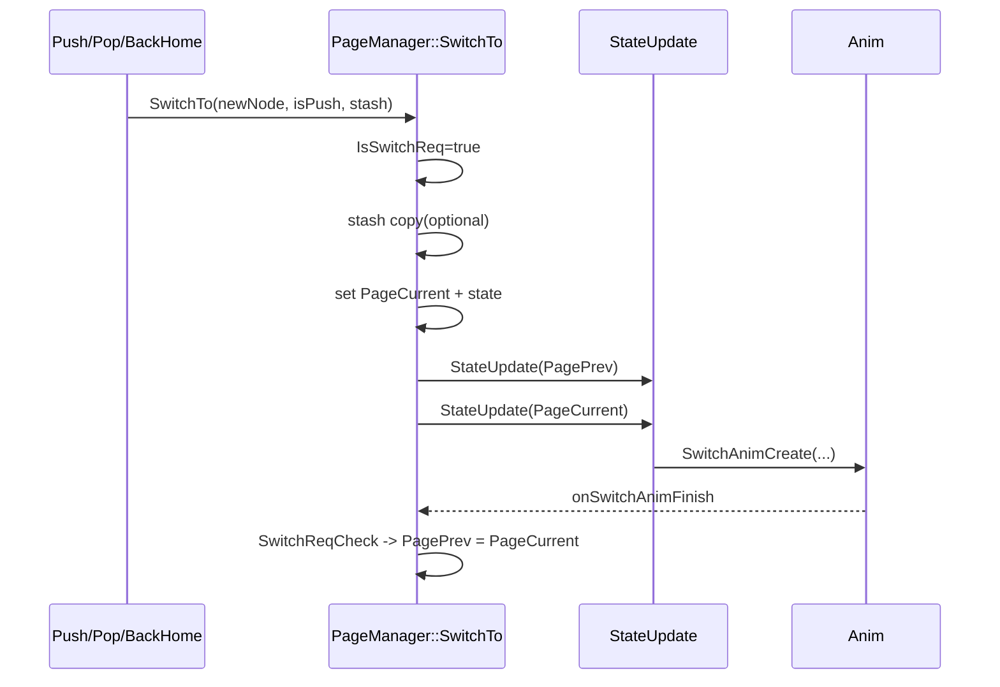

# X-TRACK 页面管理（PageManager）初始化、数据管理与调用注册详解

> 本文仅聚焦页面管理部分，按你要求详细说明：
> 1) 初始化过程；2) 页面数据管理；3) 页面管理机制；4) 调用与注册的完整流程。

---

## 1. 页面管理入口：App_Init 如何启动 PageManager

在 `App_Init()` 中，页面管理的关键动作是：

1. 创建 `AppFactory` 与 `PageManager`（静态对象）；
2. 执行 `manager.Install(...)` 注册所有页面到 `PagePool`；
3. 设置全局切页动画 `SetGlobalLoadAnimType(...)`；
4. 调用 `manager.Push("Pages/Startup")` 进入首屏并启动页面状态机。

```mermaid
flowchart TD
    A[App_Init] --> B[static AppFactory]
    B --> C[static PageManager]
    C --> D[Install: Template/LiveMap/Dialplate/SystemInfos/Startup]
    D --> E[SetGlobalLoadAnimType(OVER_TOP, 500ms)]
    E --> F[Push Pages/Startup]
    F --> G[SwitchTo + StateUpdate]
```

---

## 2. PageManager 初始化过程（构造与基础状态）

`PageManager(PageFactory* factory)` 构造时会：

- 记录工厂指针 `Factory`；
- 初始化 `PagePrev/PageCurrent = nullptr`；
- 清零 `AnimState`；
- 调用 `SetGlobalLoadAnimType()` 设置默认全局动画。

这一步完成后，PageManager 具备但尚未“加载任何页面”；只有 Install/Push 后才进入实际页面生命周期。

---

## 3. 页面注册机制：Install -> Register 的细节

## 3.1 Install 的完整步骤

`Install(className, appName)` 内部顺序：

1. 检查 `Factory` 是否有效；
2. 通过 `Factory->CreatePage(className)` 创建页面实例；
3. 重置页面基础字段（`root/ID/Manager/UserData/priv`）；
4. 调用 `onCustomAttrConfig()` 同步页面自定义属性（缓存策略、动画等）；
5. 调用 `Register(base, appName)` 放入页面池。

## 3.2 Register 的核心约束

`Register(base, name)` 会执行：

- 重名检测（`FindPageInPool(name)`）防止重复注册；
- 绑定关系：
  - `base->Manager = this`
  - `base->Name = name`
- `PagePool.push_back(base)`

由此形成“**页面实例池（PagePool）**”：页面可被路由，但尚未进入屏幕栈。

---

## 4. 页面数据管理：PagePool、PageStack、Stash、Cache

PageManager 主要管理四类数据：

## 4.1 PagePool（注册池）

- 存放已注册页面实例；
- 通过 `FindPageInPool(name)` 查找；
- 只要未卸载，页面实例长期存在。

## 4.2 PageStack（路由栈）

- 存放当前路由链；
- `Push` 入栈，`Pop` 出栈；
- `GetStackTop()` 获取当前页；
- `GetStackTopAfter()` 获取次顶页（用于动画/回退逻辑）。

## 4.3 Stash（页面参数）

`SwitchTo(..., stash)` 支持页面参数传递：

- 若目标页无 stash 内存：`lv_mem_alloc(stash->size)`；
- 若已有同尺寸 stash：复用旧内存；
- 执行 `memcpy` 后写入 `newNode->priv.Stash`。

页面可通过 `PAGE_STASH_POP` 读取参数，实现跨页数据传递。

## 4.4 Cache（页面缓存）

- `IsCached` 决定页面消失后是保留还是卸载；
- 自动缓存策略由 `ReqDisableAutoCache/ReqEnableCache` 与 `SetCustomCacheEnable` 等接口控制；
- `StateDidDisappearExecute` 中根据 `IsCached` 分流：
  - 缓存：回到 `WILL_APPEAR`（下次直接显示）；
  - 不缓存：进入 `UNLOAD` 释放资源。

---

## 5. 页面管理核心流程：Push / Pop / BackHome

## 5.1 Push 流程（入栈并显示）

`Push(name, stash)` 执行链：

1. `SwitchAnimStateCheck()` 防止动画重入；
2. 防止重复入栈 `FindPageInStack(name)`；
3. 从 `PagePool` 找实例；
4. 同步自动缓存配置；
5. `PageStack.push(base)`；
6. `SwitchTo(base, true, stash)` 完成切换。

## 5.2 Pop 流程（出栈回前页）

1. 检查动画忙状态；
2. 取当前栈顶；
3. 自动缓存场景下，出栈前将当前页 `IsCached=false`（便于卸载）；
4. `PageStack.pop()`；
5. 取新栈顶并 `SwitchTo(next, false, nullptr)`。

## 5.3 BackHome 流程（回栈底主页）

`BackHome()`：

- `SetStackClear(true)`：清理栈，仅保留底部页；
- `PagePrev = nullptr`；
- `SwitchTo(home, false)`。

该流程常用于“任意层级一键返回主页”。

---

## 6. SwitchTo：页面切换真正执行点

`SwitchTo` 是 PageManager 的核心执行函数，负责串起“数据 + 状态 + 动画 + 图层”：

1. 校验 `newNode` 非空；
2. 设置 `AnimState.IsSwitchReq = true`；
3. 处理 stash 参数（分配/复用/拷贝）；
4. 设置 `PageCurrent`；
5. 根据缓存决定初始状态：
   - 有缓存：`WILL_APPEAR`
   - 无缓存：`LOAD`
6. 设置进出场标记（`PagePrev->Anim.IsEnter=false`，`PageCurrent->Anim.IsEnter=true`）；
7. Push 场景下调用 `SwitchAnimTypeUpdate(PageCurrent)`；
8. 依次 `StateUpdate(PagePrev)` 与 `StateUpdate(PageCurrent)`；
9. 调整前后台图层顺序。



---

## 7. 页面生命周期状态机（StateUpdate）详细说明

状态推进（典型）如下：

`LOAD -> WILL_APPEAR -> DID_APPEAR -> ACTIVITY -> WILL_DISAPPEAR -> DID_DISAPPEAR -> (WILL_APPEAR/UNLOAD) -> IDLE`

各阶段职责：

1. **LOAD**
   - 创建 root（`lv_obj_create(lv_scr_act())`）
   - `onViewLoad()`
   - 根据动画类型为 root 配置可拖拽返回
   - `onViewDidLoad()`
   - 判定缓存策略
2. **WILL_APPEAR**
   - `onViewWillAppear()`
   - 显示 root
   - 启动进入动画 `SwitchAnimCreate`
3. **DID_APPEAR**
   - `onViewDidAppear()`
   - 进入 `ACTIVITY`
4. **WILL_DISAPPEAR**
   - `onViewWillDisappear()`
   - 启动离场动画
5. **DID_DISAPPEAR**
   - `onViewDidDisappear()`
   - 根据缓存选择下一状态（回显或卸载）
6. **UNLOAD**
   - 释放 stash
   - `lv_obj_del_async(root)`
   - `onViewDidUnload()`
   - 置 `IDLE`

---

## 8. 页面“调用注册”的完整闭环流程图

```mermaid
flowchart TD
    A[App_Init] --> B[Install -> Register -> PagePool]
    B --> C[Push Startup]
    C --> D[PageStack.push]
    D --> E[SwitchTo]
    E --> F[StateUpdate: LOAD/WILL_APPEAR/DID_APPEAR]
    F --> G[Page ACTIVITY]

    G --> H[用户操作: Push 新页面]
    H --> D

    G --> I[用户返回: Pop]
    I --> J[PageStack.pop + SwitchTo(上一个)]
    J --> F

    G --> K[BackHome]
    K --> L[SetStackClear(keepBottom=true)]
    L --> E
```

---

## 9. 实践建议（防踩坑）

1. 页面 name 必须唯一，建议统一 `Pages/...` 命名规约；
2. 需要跨页参数时，优先 stash，且保证结构体大小稳定；
3. 高频切换页面启用缓存，重资源页面考虑关闭缓存及时卸载；
4. Push/Pop 入口处做好节流，避免 `AnimState` 忙时连续请求被丢弃；
5. 页面生命周期函数要保持“轻逻辑”，耗时任务放到 DataProc 定时节点。

