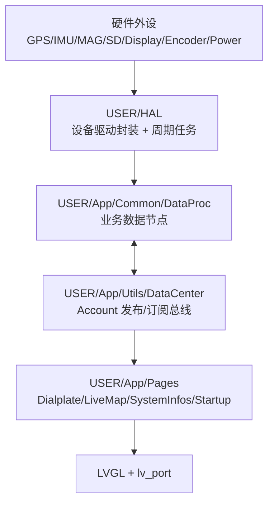
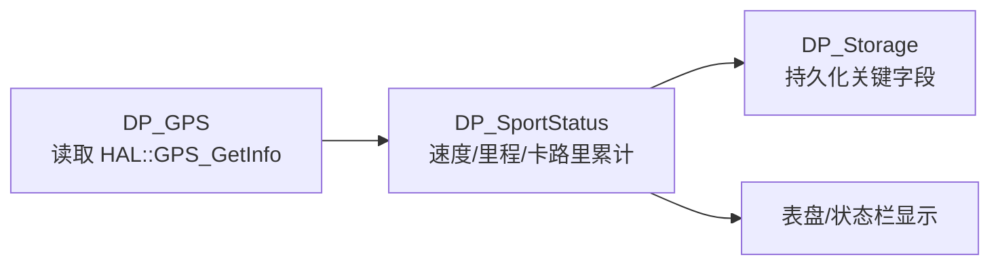
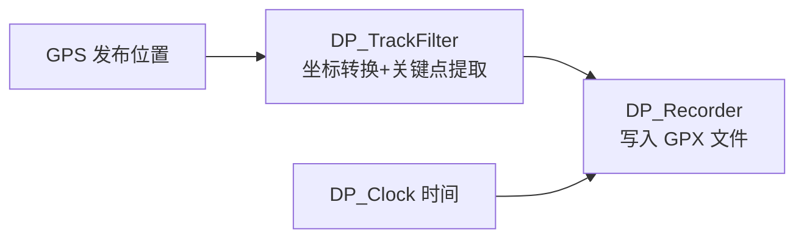

## 编译说明
* MCU固件: 务必使用**Keil v5.25**或以上的版本进行编译（旧版本编译器不能完全支持**C++ 11**的语法）。
* 编译前需要安装[Artery](https://www.arterytek.com/cn/index.jsp)官方Pack，**为了确保顺利编译请安装[Software/Pack](https://github.com/FASTSHIFT/X-TRACK/tree/main/Software/Pack)目录下的指定版本**。

* 如果安装Pack后，Keil依然报以下这类错误，可能是之前安装了 Keil v4 兼容包 (MDK v4 Legacy Support) 导致的，请尝试**卸载此包或重新安装 Keil v5**。

`Error #540: 'Keil::Device:StdPeriph Drivers:ADC:1.0.1' component is not available for target 'X-Track'`
 
  ### 注意
  **不要修改芯片选型**，因为修改芯片选型后启动文件会重新生成，堆栈大小会恢复默认值，而使用默认的栈大小会导致**栈溢出**。现象是启动后立即蓝屏，提示发生**HardFault**(如下图所示)，串口会输出详细的错误信息。如果确实需要修改芯片选型，请参考工程原始的启动文件进行修改。


* VS模拟器: 使用**Visual Studio 2019**编译，配置为**Release x86**。在`App/Common/HAL/HAL_GPS.cpp`里修改`CONFIG_TRACK_VIRTUAL_GPX_FILE_PATH`宏定义指定被读取的GPX文件的路径。

## 系统配置文件
系统会在根目录下自动生成`SystemSave.json`的文件，用于储存和配置系统参数:
```javascript
{
  "sportStatus.totalDistance": 0,              // 总里程(m)
  "sportStatus.totalTimeUINT32[0]": 0,         // 总行驶时间(ms)，低32位
  "sportStatus.totalTimeUINT32[1]": 0,         // 总行驶时间(ms)，高32位
  "sportStatus.speedMaxKph": 0,                // 最高时速(km/h)
  "sportStatus.weight": 65,                    // 体重(kg)
  "sysConfig.longitude": 116.3913345,          // 上次开机记录的位置(经度)
  "sysConfig.latitude": 39.90741348,           // 上次开机记录的位置(纬度)
  "sysConfig.soundEnable": 1,                  // 系统提示音使能(1:开启，0:关闭)
  "sysConfig.timeZone": 8,                     // 时区(GMT+)
  "sysConfig.language": "en-GB",               // 语言(尚不支持多语言切换)
  "sysConfig.arrowTheme": "default",           // 导航箭头主题(default:全黑，dark:橙底黑边，light:橙底白边)
  "sysConfig.mapDirPath": "/MAP",              // 存放地图的文件夹路径
  "sysConfig.mapExtName": "bin",               // 地图文件扩展名
  "sysConfig.mapWGS84": 0                      // 坐标系统配置(0:GCJ02, 1:WGS84)
}
```

## 目录结构
```
 X-Track
    ├─ArduinoAPI                -- 通用 Arduino API 抽象层
    ├─Core                      -- 基于标准库二次封装的抽象层
    ├─Doc                       -- 芯片相关文档
    ├─Libraries                 -- 硬件驱动程序
    │  ├─Adafruit_GFX_Library   -- Adafruit_GFX轻量级图形库
    │  ├─Adafruit_ST7789        -- ST7789屏幕驱动
    │  ├─ButtonEvent            -- 按键事件库
    │  ├─cm_backtrace           -- ARM Cortex-M 系列 MCU 错误追踪库
    │  ├─LIS3MDL                -- LIS3MDL地磁计驱动
    │  ├─LSM6DSM                -- LSM6DSM陀螺仪加速度计驱动
    │  ├─MillisTaskManager      -- 合作式任务调度器
    │  ├─SdFat                  -- 文件系统
    │  ├─StackInfo              -- 栈空间使用统计库
    │  └─TinyGPSPlus            -- NMEA协议解析器
    ├─MDK-ARM_F403A             -- AT32F403A Keil工程
    ├─MDK-ARM_F435              -- AT32F435  Keil工程
    ├─Simulator                 -- Visual Studio LVGL PC模拟器
    ├─Tools                     -- 实用工具
    └─USER                      -- 用户程序
        ├─App                   -- 应用层
        │  ├─Common             -- 通用程序
        │  │  ├─DataProc        -- 应用后台数据处理
        │  │  ├─HAL             -- 硬件抽象层定义/Mock实现
        │  │  └─Music           -- 操作音管理
        │  ├─Config             -- 应用配置文件
        │  ├─Pages              -- 页面
        │  │  ├─Dialplate       -- 表盘页面
        │  │  ├─LiveMap         -- 地图页面
        │  │  ├─Startup         -- 开机页面
        │  │  ├─StatusBar       -- 状态栏
        │  │  ├─SystemInfos     -- 系统信息页面
        │  │  └─_Template       -- 页面模板
        │  ├─Resource           -- 资源池
        │  │  ├─Font            -- 字体
        │  │  └─Image           -- 图片
        │  └─Utils              -- 通用应用层组件
        │      ├─ArduinoJson    -- JSON库
        │      ├─DataCenter     -- 消息发布订阅框架
        │      ├─Filters        -- 常用滤波算法库
        │      ├─GPX            -- GPX生成器
        │      ├─GPX_Parser     -- GPX解析器
        │      ├─lv_allocator   -- 自定义allocator
        │      ├─lv_anim_label  -- 文本动画组件
        │      ├─lv_ext         -- lvgl功能扩展
        │      ├─lv_img_png     -- PNG显示组件
        │      ├─lv_poly_line   -- 多段线控件
        │      ├─MapConv        -- WGS84/GCJ02 地图坐标转换器
        │      ├─new            -- new/delete 重载
        │      ├─PageManager    -- 页面调度器
        │      ├─PointContainer -- 坐标压缩容器
        │      ├─ResourceManager-- 资源管理器
        │      ├─StorageService -- KV储存服务
        │      ├─Stream         -- Arduino Stream 流式库
        │      ├─TileConv       -- 瓦片坐标转换器
        │      ├─Time           -- 时间转换算法库
        │      ├─TonePlayer     -- 异步方波音乐播放器
        │      ├─TrackFilter    -- 流式轨迹坐标拐点/线段提取器
        │      └─WString        -- Arduino WString 字符串库
        ├─HAL                   -- 硬件抽象层
        └─lv_port               -- lvgl与硬件的接口
```

## Software 系统框架和工作原理（基于源码）

下面从 **框架分层、启动流程、任务调度、数据链路、页面机制、关机持久化** 六个维度，说明 `Software/X-Track` 的实际工作方式。

### 1) 系统框架（分层视角）



- **HAL 层**：统一管理外设初始化与更新（电源、GPS、SD、传感器、显示、输入、音频）。
- **DataProc 层**：把“设备输入”加工成“业务状态”，例如运动统计、轨迹过滤、配置管理、录制控制。
- **UI 层**：页面只关注展示与交互，通过 DataCenter 拉取/订阅数据，避免直接耦合底层驱动。

### 2) 启动流程（main 到首屏）

```mermaid
flowchart TD
    A[main] --> B[NVIC/Delay 底层初始化]
    B --> C[HAL::HAL_Init]
    C --> D[lv_init]
    D --> E[lv_port_init]
    E --> F[App_Init]
    F --> G[DataProc_Init]
    G --> H[发送 STORAGE_CMD_LOAD + SYSCONFIG_CMD_LOAD]
    H --> I[ResourcePool::Init]
    I --> J[安装页面并 Push Startup]
    J --> K[for(;;): HAL_Update + lv_task_handler + __WFI]
```

- `main.cpp` 中，主循环固定为 `HAL::HAL_Update()` + `lv_task_handler()` + `__WFI()`。
- `App_Init()` 内完成三件关键事：
  1. 初始化 DataProc 节点；
  2. 从存储加载系统配置；
  3. 安装页面工厂并进入 `Startup` 页面。

### 3) 任务调度与实时性（HAL 层）

`HAL::HAL_Init()` 采用 `MillisTaskManager` 注册周期任务，形成“协作式调度 + 定时中断补充”的运行模型：

| 任务 | 周期 | 作用 |
|---|---:|---|
| `Power_EventMonitor` | 100 ms | 监控电源事件（如关机触发） |
| `GPS_Update` | 200 ms | 更新 GPS 数据 |
| `SD_Update` | 500 ms | 更新 SD 卡状态 |
| `Memory_DumpInfo` | 1000 ms | 打印内存/栈信息 |
| `IMU_Update` / `MAG_Update` | 1000 ms（使能时） | 传感器采样更新 |

另外，`Timer_SetInterrupt(..., 10*1000, ...)` 的中断回调会执行：
- `Power_Update()`
- `Encoder_Update()`
- `Audio_Update()`

这使输入响应、电源状态、音频播放具备较稳定的时基。

### 4) DataProc 工作原理（业务数据中枢）

`DP_LIST.inc` 定义了系统后台节点：

`Storage / Clock / GPS / Power / SportStatus / Recorder / IMU / MAG / StatusBar / MusicPlayer / TzConv / SysConfig / TrackFilter`

它们都以 `Account` 形式接入 `DataCenter`，并通过四类事件交互：
- `EVENT_PUB_PUBLISH`：发布者主动推送；
- `EVENT_SUB_PULL`：订阅者主动拉取；
- `EVENT_NOTIFY`：发送命令/通知；
- `EVENT_TIMER`：节点定时回调。

#### 典型数据链路 A：定位与运动统计



- `DP_GPS` 定时读取 GPS；卫星数达到阈值时发布定位；并在连接状态变化时通知 `MusicPlayer` 播放提示音。
- `DP_SportStatus` 以 500ms 周期计算速度、总里程、总时长、最大速度、卡路里等。

#### 典型数据链路 B：轨迹过滤与 GPX 录制



- `DP_TrackFilter` 把经纬度转地图坐标并做抽稀，只保留关键轨迹点。
- `DP_Recorder` 订阅 `GPS/Clock/TrackFilter`，在开始记录后持续写入 GPX。

#### 典型数据链路 C：配置与地图引擎

- `DP_SysConfig` 保存运行参数（时区、音效、地图目录、坐标系等）。
- `DP_Storage` 在加载时读取 JSON，并据 `SysConfig` 动态设置 `MapConv`：
  - 地图根目录 `mapDirPath`
  - 扩展名 `mapExtName`
  - WGS84/GCJ02 转换开关
  - 缩放等级范围（扫描 SD 地图目录得到）

### 5) 页面系统工作原理（PageManager）

- 页面由 `AppFactory::CreatePage()` 根据名称实例化（`Startup/LiveMap/Dialplate/SystemInfos/...`）。
- `PageManager` 负责：
  1. 页面栈路由（Push/Pop/BackHome）；
  2. 生命周期状态（Load -> WillAppear -> DidAppear -> WillDisappear -> DidDisappear -> Unload）；
  3. 切页动画与拖拽返回。

因此，UI 可保持“页面逻辑”与“数据来源”分离：页面不直接操作硬件，只消费 DataProc 输出。

### 6) 关机与数据落盘

```mermaid
flowchart TD
    PWR[电源事件] --> CB[HAL::Power_SetEventCallback(App_Uninit)]
    CB --> SAVE1[SysConfig SAVE]
    CB --> SAVE2[Storage SAVE]
    CB --> STOP[Recorder STOP]
```

`App_Uninit()` 会在关机路径执行三件事：
1. 保存系统配置；
2. 保存业务统计与存储内容；
3. 停止录制并收尾轨迹文件。

这保证了重启后可以恢复上次状态（位置、参数、累计运动数据等）。

### 7) 一句话理解 Software 的工作原理

> 该系统本质是“**HAL 周期采集 + DataCenter 消息总线 + PageManager 页面状态机**”的组合架构：底层持续产出数据，中层做业务聚合与持久化，上层按页面生命周期消费数据并渲染。 

