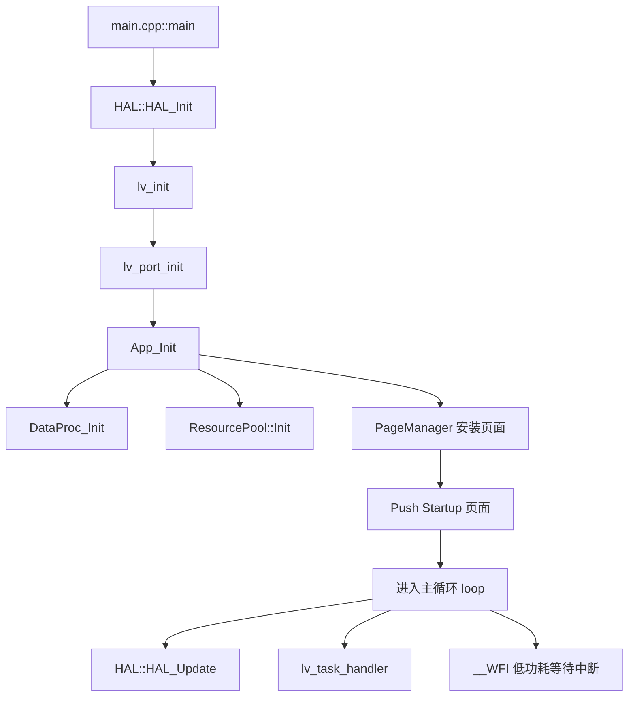
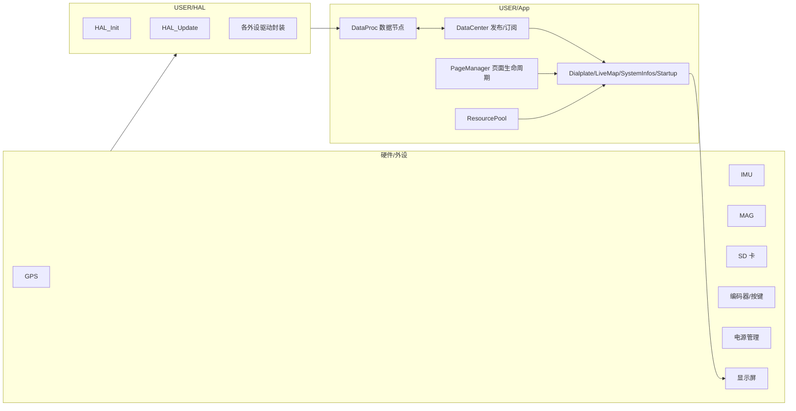
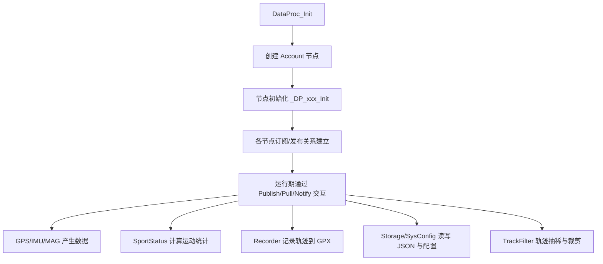
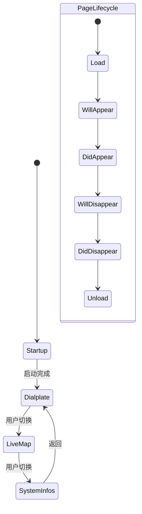
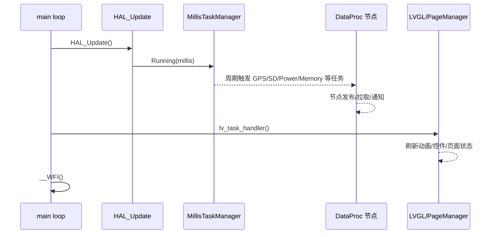
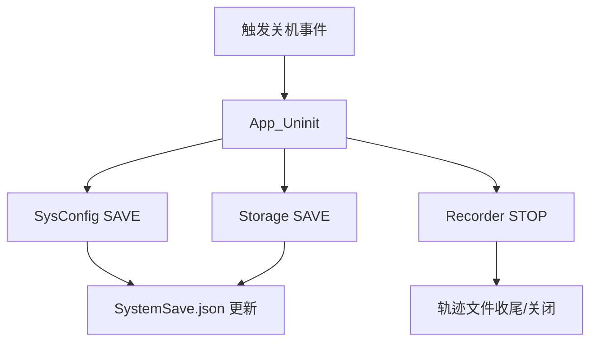

## 编译说明
* MCU固件: 务必使用**Keil v5.25**或以上的版本进行编译（旧版本编译器不能完全支持**C++ 11**的语法）。
* 编译前需要安装[Artery](https://www.arterytek.com/cn/index.jsp)官方Pack，**为了确保顺利编译请安装[Software/Pack](https://github.com/FASTSHIFT/X-TRACK/tree/main/Software/Pack)目录下的指定版本**。

* 如果安装Pack后，Keil依然报以下这类错误，可能是之前安装了 Keil v4 兼容包 (MDK v4 Legacy Support) 导致的，请尝试**卸载此包或重新安装 Keil v5**。

`Error #540: 'Keil::Device:StdPeriph Drivers:ADC:1.0.1' component is not available for target 'X-Track'`
 
  ### 注意
  **不要修改芯片选型**，因为修改芯片选型后启动文件会重新生成，堆栈大小会恢复默认值，而使用默认的栈大小会导致**栈溢出**。现象是启动后立即蓝屏，提示发生**HardFault**(如下图所示)，串口会输出详细的错误信息。如果确实需要修改芯片选型，请参考工程原始的启动文件进行修改。


* VS模拟器: 使用**Visual Studio 2019**编译，配置为**Release x86**。在`App/Common/HAL/HAL_GPS.cpp`里修改`CONFIG_TRACK_VIRTUAL_GPX_FILE_PATH`宏定义指定被读取的GPX文件的路径。

## 系统配置文件
系统会在根目录下自动生成`SystemSave.json`的文件，用于储存和配置系统参数:
```javascript
{
  "sportStatus.totalDistance": 0,              // 总里程(m)
  "sportStatus.totalTimeUINT32[0]": 0,         // 总行驶时间(ms)，低32位
  "sportStatus.totalTimeUINT32[1]": 0,         // 总行驶时间(ms)，高32位
  "sportStatus.speedMaxKph": 0,                // 最高时速(km/h)
  "sportStatus.weight": 65,                    // 体重(kg)
  "sysConfig.longitude": 116.3913345,          // 上次开机记录的位置(经度)
  "sysConfig.latitude": 39.90741348,           // 上次开机记录的位置(纬度)
  "sysConfig.soundEnable": 1,                  // 系统提示音使能(1:开启，0:关闭)
  "sysConfig.timeZone": 8,                     // 时区(GMT+)
  "sysConfig.language": "en-GB",               // 语言(尚不支持多语言切换)
  "sysConfig.arrowTheme": "default",           // 导航箭头主题(default:全黑，dark:橙底黑边，light:橙底白边)
  "sysConfig.mapDirPath": "/MAP",              // 存放地图的文件夹路径
  "sysConfig.mapExtName": "bin",               // 地图文件扩展名
  "sysConfig.mapWGS84": 0                      // 坐标系统配置(0:GCJ02, 1:WGS84)
}
```

## 目录结构
```
 X-Track
    ├─ArduinoAPI                -- 通用 Arduino API 抽象层
    ├─Core                      -- 基于标准库二次封装的抽象层
    ├─Doc                       -- 芯片相关文档
    ├─Libraries                 -- 硬件驱动程序
    │  ├─Adafruit_GFX_Library   -- Adafruit_GFX轻量级图形库
    │  ├─Adafruit_ST7789        -- ST7789屏幕驱动
    │  ├─ButtonEvent            -- 按键事件库
    │  ├─cm_backtrace           -- ARM Cortex-M 系列 MCU 错误追踪库
    │  ├─LIS3MDL                -- LIS3MDL地磁计驱动
    │  ├─LSM6DSM                -- LSM6DSM陀螺仪加速度计驱动
    │  ├─MillisTaskManager      -- 合作式任务调度器
    │  ├─SdFat                  -- 文件系统
    │  ├─StackInfo              -- 栈空间使用统计库
    │  └─TinyGPSPlus            -- NMEA协议解析器
    ├─MDK-ARM_F403A             -- AT32F403A Keil工程
    ├─MDK-ARM_F435              -- AT32F435  Keil工程
    ├─Simulator                 -- Visual Studio LVGL PC模拟器
    ├─Tools                     -- 实用工具
    └─USER                      -- 用户程序
        ├─App                   -- 应用层
        │  ├─Common             -- 通用程序
        │  │  ├─DataProc        -- 应用后台数据处理
        │  │  ├─HAL             -- 硬件抽象层定义/Mock实现
        │  │  └─Music           -- 操作音管理
        │  ├─Config             -- 应用配置文件
        │  ├─Pages              -- 页面
        │  │  ├─Dialplate       -- 表盘页面
        │  │  ├─LiveMap         -- 地图页面
        │  │  ├─Startup         -- 开机页面
        │  │  ├─StatusBar       -- 状态栏
        │  │  ├─SystemInfos     -- 系统信息页面
        │  │  └─_Template       -- 页面模板
        │  ├─Resource           -- 资源池
        │  │  ├─Font            -- 字体
        │  │  └─Image           -- 图片
        │  └─Utils              -- 通用应用层组件
        │      ├─ArduinoJson    -- JSON库
        │      ├─DataCenter     -- 消息发布订阅框架
        │      ├─Filters        -- 常用滤波算法库
        │      ├─GPX            -- GPX生成器
        │      ├─GPX_Parser     -- GPX解析器
        │      ├─lv_allocator   -- 自定义allocator
        │      ├─lv_anim_label  -- 文本动画组件
        │      ├─lv_ext         -- lvgl功能扩展
        │      ├─lv_img_png     -- PNG显示组件
        │      ├─lv_poly_line   -- 多段线控件
        │      ├─MapConv        -- WGS84/GCJ02 地图坐标转换器
        │      ├─new            -- new/delete 重载
        │      ├─PageManager    -- 页面调度器
        │      ├─PointContainer -- 坐标压缩容器
        │      ├─ResourceManager-- 资源管理器
        │      ├─StorageService -- KV储存服务
        │      ├─Stream         -- Arduino Stream 流式库
        │      ├─TileConv       -- 瓦片坐标转换器
        │      ├─Time           -- 时间转换算法库
        │      ├─TonePlayer     -- 异步方波音乐播放器
        │      ├─TrackFilter    -- 流式轨迹坐标拐点/线段提取器
        │      └─WString        -- Arduino WString 字符串库
        ├─HAL                   -- 硬件抽象层
        └─lv_port               -- lvgl与硬件的接口
```

## 软件项目流程图分析（全链路）

本文聚焦 **Software/X-Track** 软件工程，按“启动 -> 后台数据处理 -> 页面渲染 -> 关机保存”的主路径梳理系统执行流。

### 1. 启动总流程（MCU 固件）



关键点：
- `main()` 完成底层初始化后进入死循环，循环内由 `HAL_Update + lv_task_handler` 驱动“设备层任务 + GUI任务”。
- `App_Init()` 负责应用层核心装配：初始化数据处理节点、加载配置、初始化资源池、注册并跳转页面。

### 2. 软件分层与职责



分层理解：
- **HAL 层**：对电源、GPS、传感器、SD、编码器、音频、显示进行统一接口封装，并通过定时任务调度更新。
- **DataProc 层**：把“设备数据 + 业务状态 + 配置持久化 + 轨迹处理”组织成多个数据节点。
- **UI 层**：页面系统使用 PageManager 管理生命周期与切页动画，页面通过 DataCenter 订阅数据。

### 3. 后台数据处理（DataProc + DataCenter）

`DataProc_Init()` 会按 `DP_LIST.inc` 批量创建并初始化节点（如 `GPS`、`Power`、`Storage`、`Recorder`、`SysConfig`、`TrackFilter` 等）。



机制说明：
- `DataCenter` 是“消息总线”，`Account` 是节点载体。
- 节点间通过 `Publish / Pull / Notify / Timer` 事件通信，降低模块耦合。
- 启动时先发送 `STORAGE_CMD_LOAD` 与 `SYSCONFIG_CMD_LOAD`，让系统状态恢复到上次运行结果。

### 4. 页面生命周期与路由流程

页面创建入口在 `AppFactory::CreatePage()`，由字符串名映射到页面类（`Template`/`LiveMap`/`Dialplate`/`SystemInfos`/`Startup`）。



PageManager 提供：
- 页面栈（Push/Pop/BackHome）；
- 生命周期状态机（Load/Appear/Disappear/Unload）；
- 统一切页动画与拖拽交互。

### 5. 运行期主循环与时序



解释：
- 时间敏感的数据采集和状态检查由任务管理器周期驱动。
- GUI 更新与页面状态机由 LVGL 任务处理器驱动。
- `__WFI()` 让 MCU 在空闲周期降低功耗。

### 6. 关机与数据落盘流程



- 关机回调在初始化阶段通过 `HAL::Power_SetEventCallback(App_Uninit)` 注册。
- 退出阶段优先保存配置与统计，并停止记录器，尽量降低掉电丢失风险。

### 7. 软件部分的“项目流”总结

如果从工程管理视角看，软件主链路可以概括为：

1. **平台启动**：`main` 完成 MCU + HAL + LVGL + App 装配；
2. **状态恢复**：读取存储与系统配置；
3. **实时运行**：传感器/GPS/电源任务持续产出数据，DataCenter 在节点间分发；
4. **界面呈现**：页面系统根据订阅数据刷新 UI，并处理用户交互；
5. **持久化收尾**：关机时保存配置与轨迹，完成一次闭环。

> 对后续二次开发建议：
> - 新增业务优先以 DataProc 节点接入，避免直接跨页面调用；
> - 新页面通过 AppFactory + PageManager 生命周期接入；
> - 将“设备采集频率”和“UI刷新频率”解耦，保持界面流畅和功耗平衡。
