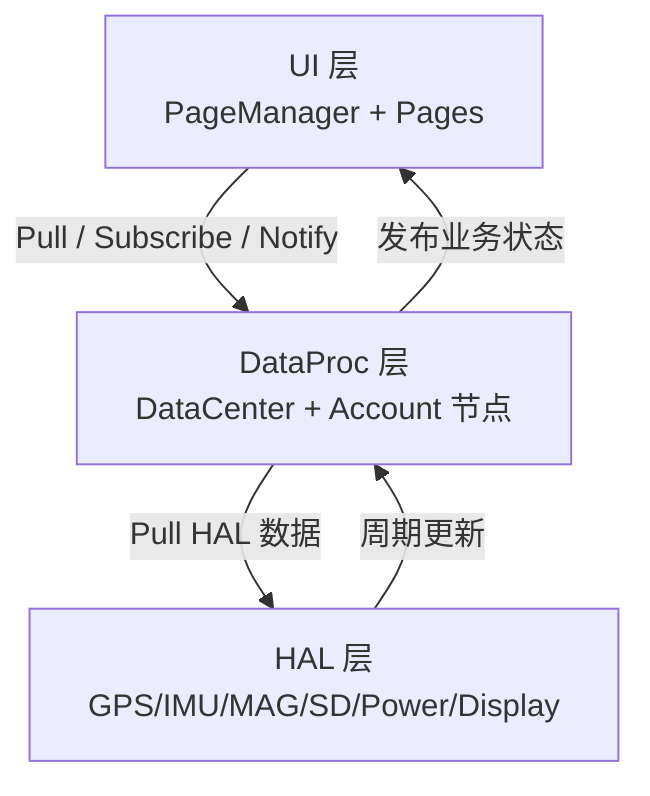
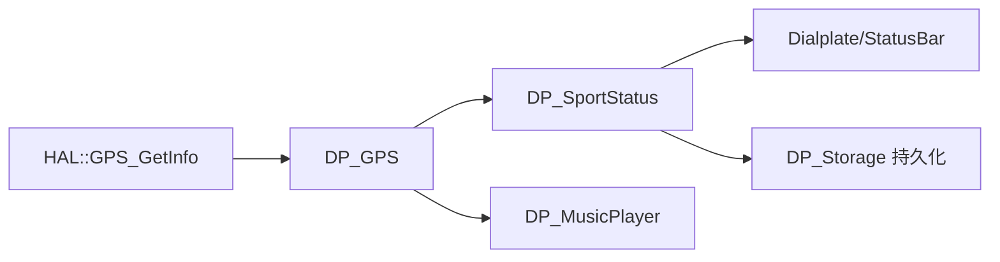
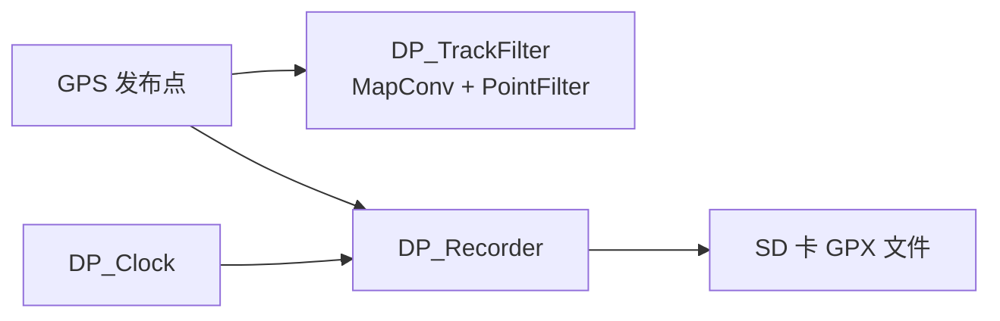
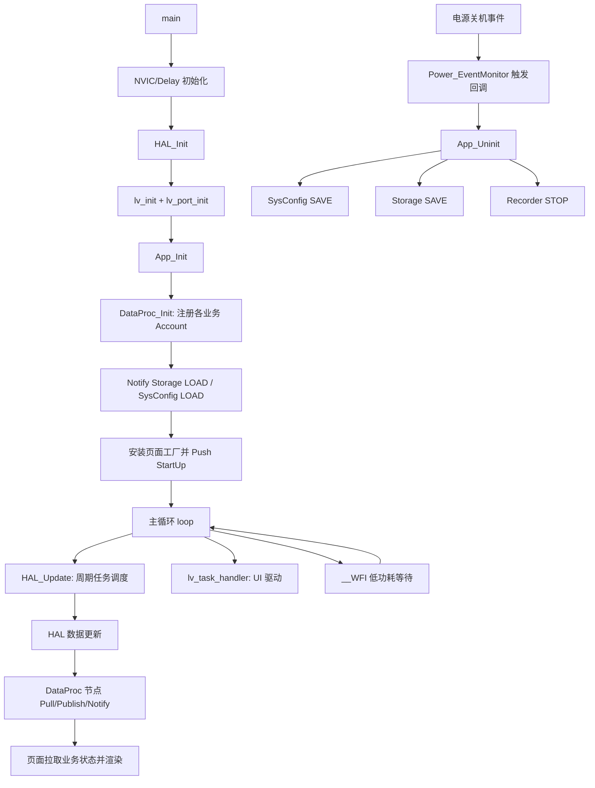

# X-TRACK Software 三层总体设计分析（基于源码）

> 分析范围：`Software/X-Track` 固件主工程（MCU 端），从“硬件抽象层（HAL）—业务数据层（DataProc）—应用展示层（UI/Page）”三层结构说明系统设计思路与程序流。

---

## 1. 三层架构总览

项目并非传统 RTOS 线程模型，而是 **主循环 + 协作式任务 + 消息总线** 的组合：

- **底层（HAL）**：完成外设初始化、周期采集与中断节拍驱动；
- **中层（DataProc）**：以 `DataCenter/Account` 为总线，将传感器数据加工为业务状态并统一命令；
- **上层（UI）**：以 `PageManager` 管理页面栈和生命周期，页面通过拉取/订阅 DataProc 数据渲染。

---

## 2. 第一层：HAL（硬件抽象与时基驱动）

### 2.1 设计职责

HAL 负责把具体硬件操作封装为统一 API（如 `GPS_GetInfo`、`SD_GetReady`、`Power_Shutdown`），并通过：

1. **任务调度器 `MillisTaskManager` 的周期任务**；
2. **定时中断回调（10ms）**；

构成“软实时”更新框架。

### 2.2 初始化与调度机制

在 `HAL::HAL_Init()` 中：

- 初始化串口、故障追踪、电源、背光、编码器、时钟、GPS、音频、SD、显示；
- 可选初始化传感器（I2C 扫描后启用 IMU/MAG）；
- 注册周期任务：
  - `Power_EventMonitor`（100ms）
  - `GPS_Update`（200ms）
  - `SD_Update`（500ms）
  - `Memory_DumpInfo`（1000ms）
  - 以及可选看门狗与传感器任务
- 启动硬件定时中断，在回调中执行 `Power_Update/Encoder_Update/Audio_Update`。

该层的价值是：**把不同外设的更新频率“离散化”为统一调度事件**，上层无需关心寄存器细节。

---

## 3. 第二层：DataProc（业务数据中枢）

### 3.1 设计职责

DataProc 是系统核心“中台”：

- 使用 `DP_LIST.inc` 批量注册业务节点（Storage/Clock/GPS/SportStatus/Recorder/TrackFilter 等）；
- 每个节点本质是一个 `Account`，通过 `EVENT_PUB_PUBLISH` / `EVENT_SUB_PULL` / `EVENT_NOTIFY` / `EVENT_TIMER` 交互；
- 对外屏蔽原始硬件信号，输出可直接驱动界面的业务数据。

### 3.2 关键链路 A：GPS -> 运动统计

- `DP_GPS` 定时读取 HAL 的 GPS 数据；
- 卫星状态变化时通知 `MusicPlayer` 播放提示；
- 有效定位（卫星>=3）时发布坐标；
- `DP_SportStatus` 订阅 GPS 并按周期计算：当前速度、累计里程、总时长、均速、最高速度、卡路里。

### 3.3 关键链路 B：轨迹过滤 -> GPX 记录

- `DP_Recorder` 订阅 `GPS/Clock/TrackFilter`；
- 收到开始记录命令后创建 GPX 文件并写头；
- GPS 发布点到来时，若处于 active 状态则写入轨迹点；
- 同时通知 `DP_TrackFilter` 同步状态，`TrackFilter` 完成坐标转换与抽稀。

### 3.4 关键链路 C：配置加载 -> 地图引擎参数

`DP_Storage` 在 `STORAGE_CMD_LOAD` 后：

1. 读取 `SystemSave.json`；
2. Pull `SysConfig` 获取地图目录、坐标系、扩展名等；
3. 配置 `MapConv` 的路径、坐标转换开关、缩放等级范围；
4. 供 LiveMap 页面使用。

这使系统具备“启动加载配置 -> 动态重构地图行为”的能力。

---

## 4. 第三层：UI / Page（展示与交互编排）

### 4.1 设计职责

UI 层主要由三部分构成：

- `AppFactory`：按页面名创建页面实例（StartUp/LiveMap/Dialplate/SystemInfos）；
- `PageManager`：管理页面安装、栈路由、切换动画、拖拽返回；
- `PageBase`：定义统一生命周期状态机。

`PageBase::State_t` 明确了页面阶段：

`LOAD -> WILL_APPEAR -> DID_APPEAR -> ACTIVITY -> WILL_DISAPPEAR -> DID_DISAPPEAR -> UNLOAD`

因此页面开发只需关注视图与交互，不与硬件直接耦合。

### 4.2 App 初始化动作

`App_Init()` 的顺序很关键：

1. `DataProc_Init()` 建立业务节点；
2. 向 Storage/SysConfig 发送 LOAD 命令；
3. 初始化屏幕基础样式与资源池；
4. 创建状态栏；
5. 安装页面并 `Push("Pages/StartUp")`。

该流程说明 UI 并不是“先画图再补数据”，而是先建立数据平面，再进入首屏。

---

## 5. 三层协同的完整程序流程图

下面流程图展示从上电到运行再到关机保存的端到端路径：

---

## 6. 设计优点与工程意义

### 优点

1. **低耦合**：UI 不直接访问外设，业务节点不直接操作页面；
2. **可维护**：节点式 DataProc 便于新增功能（新增 `DP_xxx` 即可接入总线）；
3. **可移植**：HAL 与 `App/Common/HAL` 的分层让 MCU 与 PC 模拟器共享较多上层逻辑；
4. **可诊断**：串口日志、故障追踪、内存输出、页面状态机让问题定位更直观。

### 代价与注意点

1. 协作式调度对“单次任务耗时”敏感，长阻塞会影响 UI 刷新；
2. DataCenter 是软总线，消息尺寸与事件语义需严格一致（大量 size check）；
3. 关机保存链路依赖电源事件回调，异常断电仍可能丢失最近状态。

---

## 7. 一句话总结

X-TRACK Software 的本质是：**HAL 提供稳定采集时基，DataProc 完成业务聚合与命令编排，UI 通过页面状态机消费业务数据**；三层通过 DataCenter 连接，形成“可扩展、可维护、偏事件驱动”的嵌入式应用架构。
