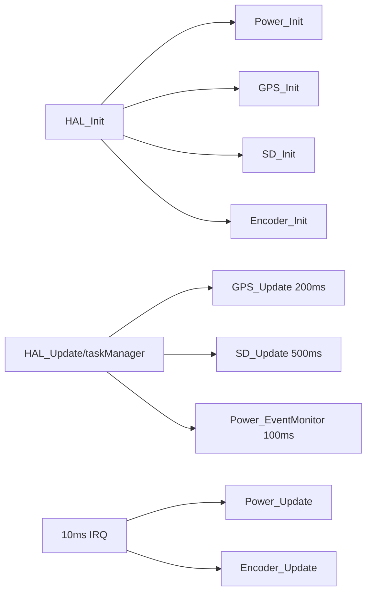
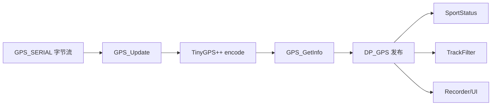
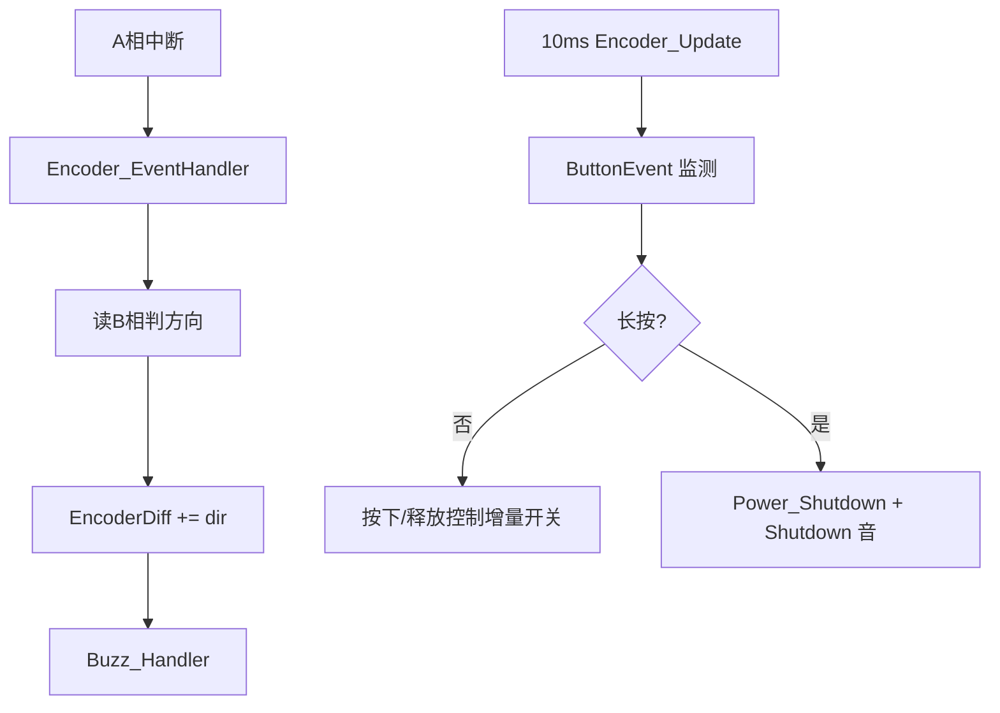

# X-TRACK 子模块程序流程详解：Power / GPS / SD / Encoder

> 本文针对你指定的四个模块，逐一回答：
> 1) 子模块程序流程；2) 被调用后的设计思路；3) 设计与实现如何落地。

---

## 1. 模块在系统中的调用入口

这四个子模块都由 `HAL` 编排层统一调用，不直接由页面层触发：

- `HAL_Init()`：完成各模块初始化；
- `taskManager` 周期任务：调用 `GPS_Update`、`SD_Update`、`Power_EventMonitor`；
- `10ms IRQ` 回调：调用 `Power_Update`、`Encoder_Update`（以及 Audio）。



---

## 2. Power 子模块

## 2.1 程序流程（运行路径）

1. `Power_Init()`：
   - 控制 `POWER_EN` 完成上电保持时序；
   - 初始化电池 ADC 与充电检测脚；
   - 默认关闭自动低功耗策略。
2. `Power_Update()`（10ms IRQ 路径）：
   - 每 1000ms 调一次 `Power_ADC_Update`；
   - 若启用自动低功耗且超时，调用 `Power_Shutdown()` 置关机请求位。
3. `Power_EventMonitor()`（100ms 任务路径）：
   - 发现 `ShutdownReq=true` 后，先调用上层回调（`App_Uninit`）；
   - 背光渐暗；
   - 拉低 `POWER_EN` 真正下电。
4. `Power_GetInfo()`：将 ADC 值转成 `voltage/usage/isCharging` 提供给上层。

## 2.2 被调用后的设计思路

核心思路是“**请求与执行解耦**”：

- 请求：中断/事件里只置位，保持轻量；
- 执行：在任务上下文串行完成“保存 -> 灭屏 -> 下电”。

这样能避免在中断中执行重操作，提升稳定性。

## 2.3 设计与实现落地要点

- 使用 `CM_EXECUTE_ONCE` 防止重复置关机请求；
- 采样采用“两拍法”减少阻塞；
- 电压先做分压还原再限幅，最后映射电量百分比；
- 通过 `Power_SetEventCallback` 与 App 保存流程联动。

```mermaid
flowchart TD
    IRQ[Power_Update] --> A{自动低功耗开启?}
    A -- 否 --> END1[返回]
    A -- 是 --> B{超时?}
    B -- 否 --> END1
    B -- 是 --> C[Power_Shutdown 置位]

    TM[Power_EventMonitor] --> D{ShutdownReq?}
    D -- 否 --> END2[返回]
    D -- 是 --> E[EventCallback(App_Uninit)]
    E --> F[Backlight_SetGradual]
    F --> G[POWER_EN LOW 下电]
```

---

## 3. GPS 子模块

## 3.1 程序流程（运行路径）

1. `GPS_Init()`：打开 GPS 串口（9600）。
2. `GPS_Update()`（200ms 任务）：
   - 循环读取串口字节；
   - 逐字节喂给 `TinyGPSPlus::encode(c)` 解析。
3. `GPS_GetInfo()`：
   - 按需读取解析快照，填充 `GPS_Info_t`。
4. DataProc 层 `DP_GPS`：
   - Timer 里 Pull HAL 快照；
   - 有效星数达到阈值后 `Commit+Publish` 给下游（SportStatus/TrackFilter/Recorder/UI）。

## 3.2 被调用后的设计思路

采用“**持续喂流 + 快照读取**”：

- `GPS_Update` 专注输入解析；
- `GPS_GetInfo` 专注输出结构化结果；
- 上层业务不关心 NMEA 细节，只消费统一结构体。

## 3.3 设计与实现落地要点

- 透明串口模式可用于调试透传；
- 用卫星数阈值控制“发布数据”和“提示音状态”逻辑；
- DataProc 统一发布，页面不直接读驱动。



---

## 4. SD 子模块

## 4.1 程序流程（运行路径）

1. `SD_Init()`：
   - 检测卡是否插入；
   - 调用 SdFat 初始化；
   - 注册 FAT 时间回调（使用 `Clock_GetInfo`）；
   - 检查并自动创建轨迹目录。
2. `SD_Update()`（500ms 任务）：
   - 读取卡检测脚；
   - 通过 `CM_VALUE_MONITOR` 仅在状态变化时进入 `SD_Check`。
3. `SD_Check(isInsert)`：
   - 插入：重新初始化，成功后触发 `SD_EventCallback(true)`，播放插入音；
   - 拔出：标记不可用，回调 `false`，清卡容量，播放拔出音。

## 4.2 被调用后的设计思路

采用“**事件化插拔管理**”而不是每次全量重初始化：

- 周期只检测状态；
- 变化时才执行重操作；
- 用回调把状态变化通知 DataProc（如 Storage 重载）。

## 4.3 设计与实现落地要点

- `SD_SetEventCallback` 打通驱动到业务层；
- `SD_GetTypeName/SD_GetCardSizeMB` 提供页面展示所需信息；
- 文件时间戳回调保证 GPX 等文件时间正确。

```mermaid
flowchart TD
    A[SD_Update] --> B[读取 CD 引脚]
    B --> C{插拔状态变化?}
    C -- 否 --> END[返回]
    C -- 是 --> D[SD_Check]
    D --> E{isInsert?}
    E -- 是 --> F[SD_Init + callback(true) + 插入音]
    E -- 否 --> G[ready=false + callback(false) + 拔出音]
```

---

## 5. Encoder 子模块

## 5.1 程序流程（运行路径）

1. `Encoder_Init()`：
   - 配置 A/B 相与按键引脚；
   - A 相绑定下降沿中断 `Encoder_EventHandler`；
   - 绑定按键事件处理器 `Encoder_PushHandler`。
2. 旋转中断 `Encoder_EventHandler()`：
   - 读取 B 相判断方向；
   - 累加 `EncoderDiff`；
   - 调用 `Buzz_Handler` 给出旋转音反馈。
3. `Encoder_Update()`（10ms IRQ 路径）：
   - 执行 `ButtonEvent` 状态机。
4. `Encoder_PushHandler()`：
   - 按下/释放切换 `EncoderDiffDisable`；
   - 长按触发 `Power_Shutdown()` + `Audio_PlayMusic("Shutdown")`。
5. 上层通过 `Encoder_GetDiff()` 取增量并清零。

## 5.2 被调用后的设计思路

采用“**旋转中断 + 按键状态机**”混合方案：

- 旋转需要快响应，用 GPIO 中断；
- 长按判断需要时间维度，用周期状态机；
- 两者配合兼顾响应性和可控性。

## 5.3 设计与实现落地要点

- `EncoderDiff` 使用 `volatile` 适配中断并发；
- 按下时禁用旋转增量，防止误触；
- 长按不直接下电，而是走 Power 模块请求流程，保持统一关机路径。



---

## 6. 四模块协同关系（总结）

- **Power**：管理电源状态与关机执行；
- **GPS**：提供位置与速度源数据；
- **SD**：提供持久化介质与热插拔事件；
- **Encoder**：提供用户输入与关机触发入口。

四者通过 HAL 统一调度、通过 DataProc 统一业务化，最终由页面统一展示。
